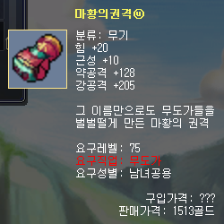
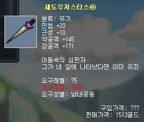
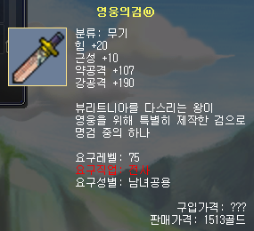
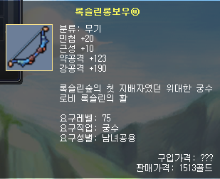
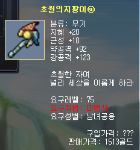
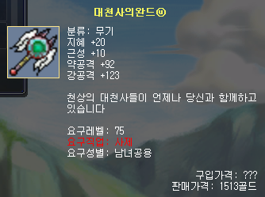
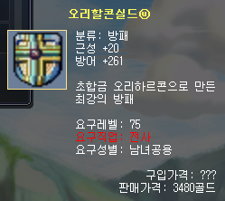
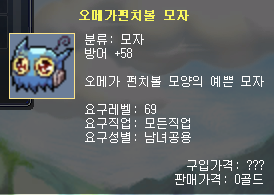

# [Update] New Dungeon "Stop the Ultimate Weapon!"

Hello,
This is the Wind Slayer Team.

We would like to inform all adventurers who enjoy Wind Slayer that a new dungeon, "Stop the Ultimate Weapon!", has been added through this update.

Please find the key details of this exciting new challenge below.

### ■ Dungeon Information

- **Dungeon Name**: Stop the Ultimate Weapon!
- **Entry NPC**: Dungeon Keeper
  - ※ The NPC "Dungeon Keeper" is located in Popola Village.
- Entry Requirement: Level 69 or higher.

### ■ Monsters

- Iron Ball MK2: Lv.69
- Bolku: Lv.70
- Quaker Ball: Lv.73
- Electroide: Lv.75
- The King Golem: Lv.77
- Omega Punch Ball: Lv.78

### ■ Dungeon Rewards

#### Accessories

| Item Name                   | Item Name             | Item Name               |
| --------------------------- | --------------------- | ----------------------- |
| Ring of Road - Fire         | Atomic Ring - STR     | Silver                  |
| Ring of Road - Water        | Atomic Ring - DEX     | Elestone Medium         |
| Ring of Road - Earth        | Atomic Ring - INT     | Gold                    |
| Ring of Road - Wind         | Atomic Ring - SPR     | Topaz                   |
| Last Leaf - Fire            | Omega Ring - STR      | Flower Bird Leaf        |
| Last Leaf - Water           | Omega Ring - DEX      | Mercury Leaf            |
| Last Leaf - Earth           | Omega Ring - INT      | Earth Leaf              |
| Last Leaf - Wind            | Omega Ring - SPR      | Harvest Leaf            |
| Yuliana's Tear - Fire       | Atomic Necklace - STR | Diamond Flower Leaf     |
| Yuliana's Tear - Water      | Atomic Necklace - DEX | Titanium                |
| Yuliana's Tear - Earth      | Atomic Necklace - INT | Blue Jade Wood Fragment |
| Yuliana's Tear - Wind       | Atomic Necklace - SPR | Elestone Large          |
| Necklace of Life - Fire     | Omega Necklace - STR  | Mid-grade Elementium    |
| Necklace of Life - Water    | Omega Necklace - DEX  | Mithril                 |
| Necklace of Life - Earth    | Omega Necklace - INT  | High-grade Elementium   |
| Necklace of Life - Wind     | Omega Necklace - SPR  | Ruby                    |
| Gladia Belt - Fire          | Atomic Belt - STR     | Sapphire                |
| Gladia Belt - Water         | Atomic Belt - DEX     | Flower Bird Blossom     |
| Gladia Belt - Earth         | Atomic Belt - INT     | Mercury Blossom         |
| Gladia Belt - Wind          | Atomic Belt - SPR     | Earth Blossom           |
| Luxury Leather Belt - Fire  | Omega Belt - STR      | Harvest Blossom         |
| Luxury Leather Belt - Water | Omega Belt - DEX      | Diamond Flower Blossom  |
| Luxury Leather Belt - Earth | Omega Belt - INT      | Elestone Deluxe         |
| Luxury Leather Belt - Wind  | Omega Belt - SPR      | Adamantium              |
| Crescent Earrings - Fire    | Atomic Earrings - STR | Demon Emperor's Fist ⓤ  |
| Crescent Earrings - Water   | Atomic Earrings - DEX | Shadow Justice ⓤ        |
| Crescent Earrings - Earth   | Atomic Earrings - INT | Hero's Sword ⓤ          |
| Crescent Earrings - Wind    | Atomic Earrings - SPR | Roxlin Longbow ⓤ        |
| Earrings of Life - Fire     | Omega Earrings - STR  | Transcendent Staff ⓤ    |
| Earrings of Life - Water    | Omega Earrings - DEX  | Archangel's Wand ⓤ      |
| Earrings of Life - Earth    | Omega Earrings - INT  | Orichalcon Shield ⓤ     |
| Earrings of Life - Wind     | Omega Earrings - SPR  | Omega Punch Ball Hat    |

#### Special Equipments

- Demon Emperor’s Fist ⓤ

  

- Shadow Justice ⓤ

  

- Hero’s Sword ⓤ

  

- Roxlin Longbow ⓤ

  

- Transcendent Staff ⓤ

  

- Archangel’s Wand ⓤ

  

- Orichalcon Shield ⓤ

  

- Omega Punch Ball Hat

  

#### Additional Materials & Items

- Silver / Gold / Titanium / Mithril / Adamantium
- Ruby / Sapphire / Topaz
- Mid-grade & High-grade Elementium
- Elestone (Medium / Large / Deluxe)
- Various elemental leaves and flowers

※ Rewards may not be obtained depending on probability upon dungeon clear.

※ Rewards cannot be obtained if your inventory storage is full.

※ Detailed probability information will be disclosed via the wiki.
