# Low-Level Progression Guide (Lv. 1–13)

If you follow this route exactly:

- **Without EXP Coupon**: You will usually finish around Lv.12–13
- **With EXP Coupon**: You will usually finish around Lv.14–15
- **Stats**: Put **ALL points into STR**. You will receive a free stat reset after your 1st Job Advancement.

---

## 1. Level 1–3 (Popola Hunting Ground)

- Hunt in the Popola field until Lv.3.
- Try to collect **5 Herb Seeds** if possible.
- Accept the Lv.3 weapon quest from **Rona (NPC next to the Village Chief)**.

### Village Chief Quest

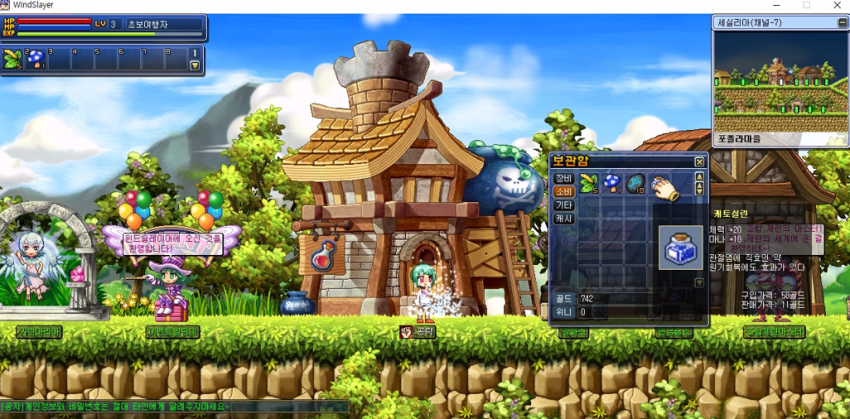

- Complete the "Aching Joints" quest.
- Purchase the required item from the General Store and turn it in.

---

## 2. Level 3–5 (Front Yard)

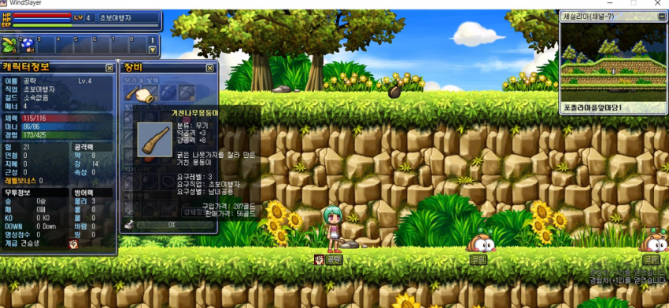

- Move to the Front Yard and level to 5.
- Collect **5 Golden Leaves**.
- Leon gives the Lv.5 Strong Attack quest (requires 5 leaves).

If Golden Leaves are not dropping well:

- Take the Ororing hunting quest.
- Go to Forest Path 1 and hunt Ororings.

After reaching Lv.5:

- Buy a **Lv.5 Iron Club** from the Weapon Shop.

---

## 3. Level 5+ (Move to Marble Mountain also called Ozi Village)

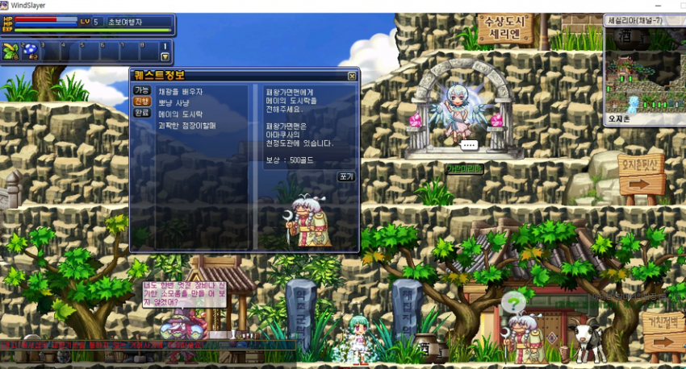

- Move to Marble Mountain(Ozi Village) at Lv.5.
- Accept the **Lunchbox Quest** from the Grandma (gives good gold).
- Move to the Gathering Area.

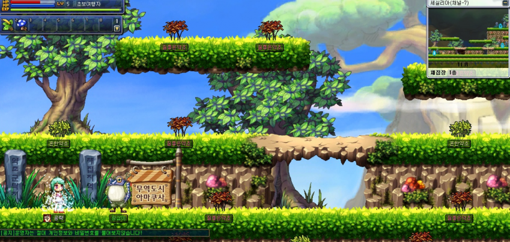

- Head left toward Amakusa.

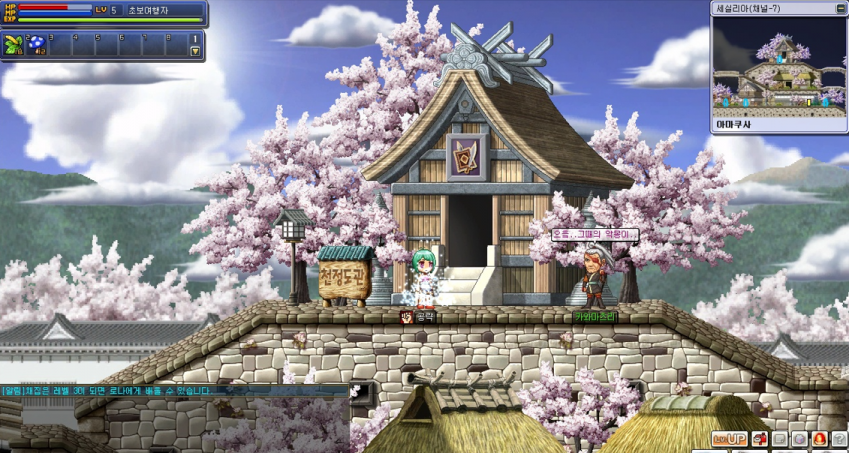

- Enter Warrior School.
- Deliver the lunchbox to the Warrior Job Instructor.
- Return to Ozi Village.

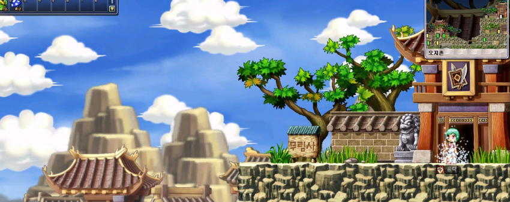

- Go to the top-right area and deliver the lunchbox to the Monk Instructor.
- Return to Grandma to complete the quest.

After that:

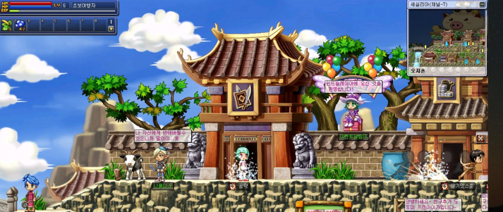

- Enter the Outland Village Weapon Shop.
- Purchase a **Wooden Sword**.

---

## 4. Level 7 Route

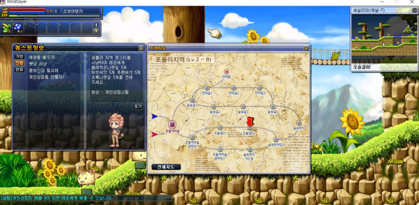

- Accept the Pponyang hunting quest.
- Go to Trail 2 and level to 7.
- Talk to the Mage Instructor to receive the "Health Tonic" quest (reward: 500 gold).
- The Mining skill quest can still be accepted at Lv.13, so you may ignore it for now.

After reaching Lv.7:

- Equip the Wooden Sword.
- Move to Hill’s End and level to 8.

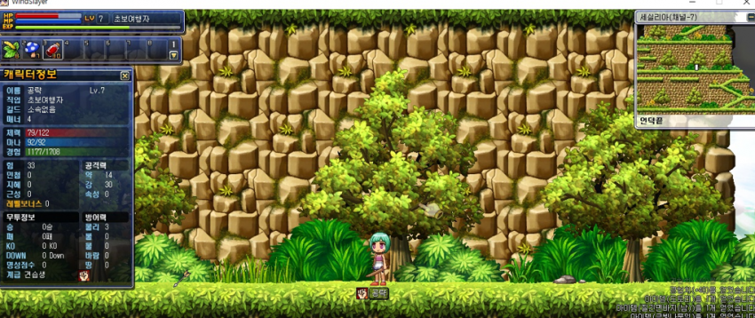

- Many players farm Rynx here; ask for **Chest Fur** (Defense & Evasion quest item) if needed.

---

## 5. Level 8–9 (Serien Route)

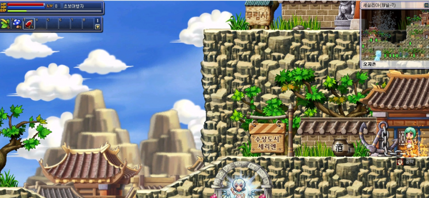

- Go to Serien.
- Accept two hunting quests from the Priest Instructor:
  - Hunt Flying Peach x1
  - Hunt Dumpling Pig x1

Then:

- Go to Outland Village Side Path 2.
- Hunt Dumpling Pigs and Flying Peaches until Lv.9.
- After collecting enough Pork, move to Side Path 1.
  - This area only spawns Peaches.

### Collect the following:

- 15 White Feathers
- 10 White Wing Fragments
- 10 Pork
- 5 Peaches

---

## Job Material Notes

- Mage / Thief: These materials are required for Job Advancement.
- Priest: Required for Job Quest hunting.
- You may complete them after advancing to earn extra potions.
- If you do not need potions, simply reach Lv.9 and move on.

---

## 6. Level 9–13 (Fast EXP Rotation – VERY IMPORTANT)

At Lv.9:

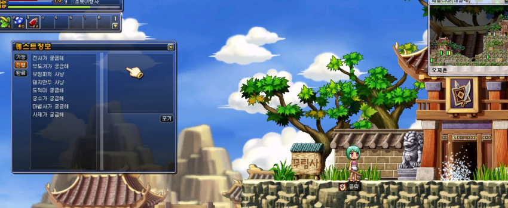

- Accept all 6 "Curiousity about…" series quests from the Village Chief.
- These are extremely efficient EXP quests.

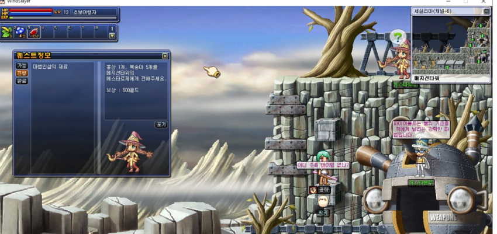

If you collected 5 Peaches:

- Buy 1 Red Ginseng (for the follow-up "Need Health Tonic" quest).
- Make sure "Need Health Tonic" appears in your active quest list.

### Rotate clockwise around Outland Village:

- Priest → 2 hunting quests
- Archer → 15 White Feathers
- Thief → 10 Pork
- Mage → 10 White Wing Fragments

You will usually finish near the Mage area.
Complete the Health Tonic follow-up quest there.

---

## 7. Final Preparation Before Job Advancement

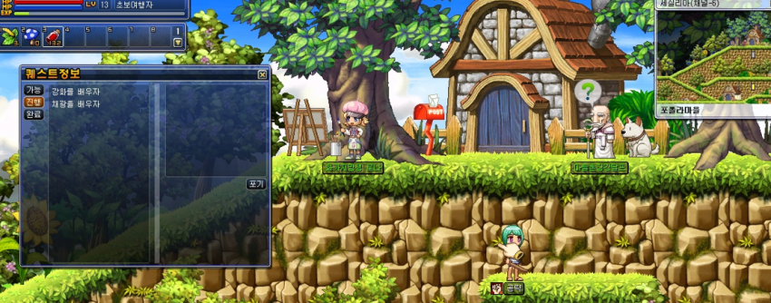

Return to Popola and accept ALL remaining skill quests:

- Enhancement
- Mining
- Gathering
- Personal Shop
- Defense & Evasion

IMPORTANT:
If you do not accept these now, you will need to pay 3,000 gold later to learn them.

---

## Estimated Time

- Fast run: ~40 minutes
- Average: ~50 minutes
- Slow run: ~1 hour

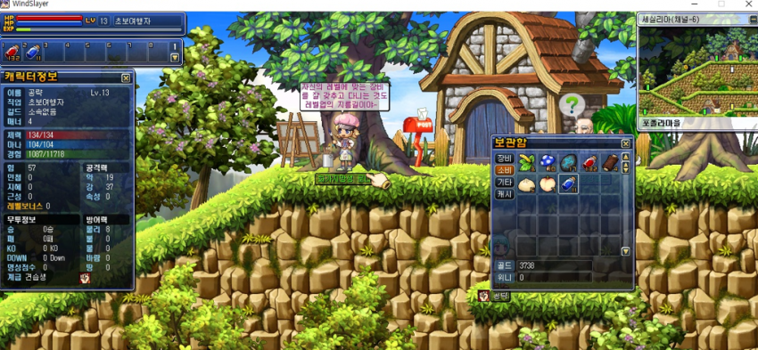

By the end:

- You should have a decent amount of HP potions.
- You should have a solid amount of gold.
- You will be around Lv.12–15 depending on EXP boosts.

Now go complete your Job Advancement.
