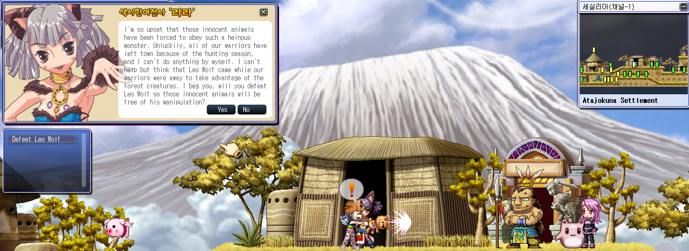

# WindSlayer Language Patching Tool

A lightweight deployment tool that automatically applies English localization files to the Korean **WindSlayer** client.

This tool is designed for global players who want a safer, faster, and more convenient way to patch language files without manually navigating the client directory.

## Overview

The WindSlayer Language Patching Tool:

- Automatically detects the WindSlayer installation path using the `ws://` protocol
- Locates the internal `hs` directory
- Safely backs up existing files before replacing them
- Applies updated localization files in one click

### What This Tool Does

When executed, the tool will:

1. Detect the registered WindSlayer client path from Windows registry.
2. Identify the `hs` folder inside the installation directory.
3. Create a local `backup` folder.
4. Backup any existing target files using a timestamped filename.
5. Copy new localization files into the client directory.

### How to Use

#### 1. Download

Download the latest release package in [here](https://github.com/wizley9999/windslayer.io/releases).

#### 2. Extract

Extract all files into the same folder.

The folder should contain:

```
## PATCHER

- run.bat
- hs.ps1

## RESOURCES

- UILngKo.lng
- QSTLngKo.lng
- NPCLngKo.lng
- MapLngKo.lng
- ITMLngKo.lng
- windslayer.hpt
- windslayer.bct
```

#### 3. Execute

Double-click:

```
run.bat
```

Windows will prompt for Administrator permission.

Approve the request.

The patching process will begin automatically.

## Backup System

If a file already exists in the `hs` directory:

- It will be copied into a local `backup` folder.
- The filename format will be:

```
filename-bak-YYYYMMDDHHMMSS.ext
```

Example:

```
UILngKo-bak-20260123101248.lng
```

If the file does not exist in the client directory:

- It will simply be copied without backup.

If you experience any issues after patching, you can restore the previous state by copying the appropriate backup file back into the `hs` directory and removing the modified file.

## Limitations

- This tool only replaces specified localization files.
- It does not modify core executables.
- It does not bypass regional restrictions.
- It does not fully translate every part of the client. Some in-game text, system messages, or UI elements may remain in Korean depending on how the original client handles localization.

## Disclaimer

This tool is unofficial and not affiliated with Sesisoft.

Use at your own risk.

The author is not responsible for:

- Account suspensions
- Game restrictions
- Data loss
- System instability
- Any consequences resulting from file modification

Users are responsible for ensuring compliance with the game's Terms of Service.

## Screenshots


